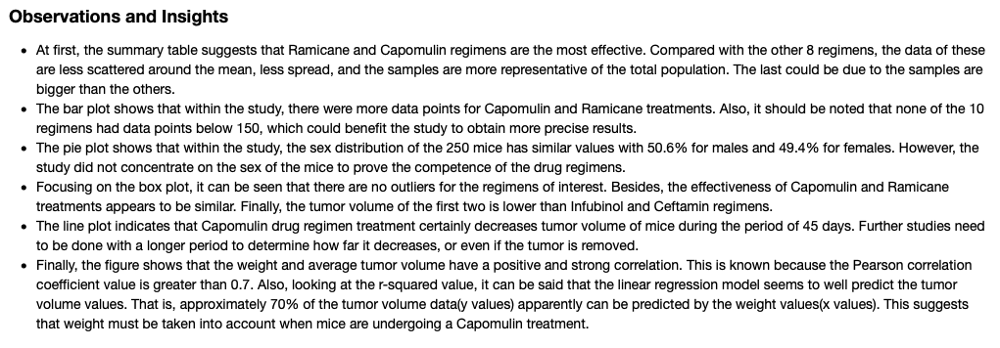
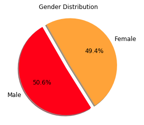
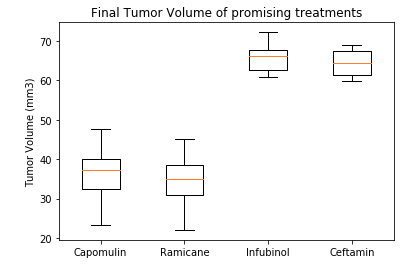
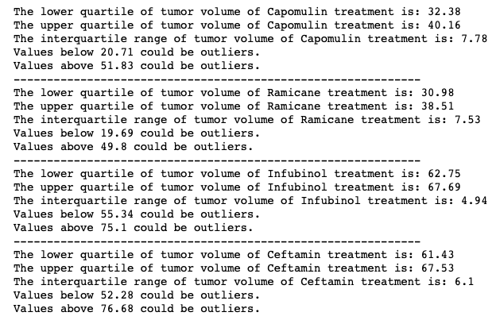

# Pymaceuticals Analysis

The purpose of this analysis was to compare the performance of Pymaceuticals' drug of interest, Capomulin, versus the other treatment regimens by generating all of the tables and figures needed for the technical report of the study. Also, a summary of the study results was generated. Pymaceuticals specializes in anti-cancer pharmaceuticals. This company began screening for potential treatments for squamous cell carcinoma (SCC), a commonly occurring form of skin cancer.

## Features

* Summary statistics tables with pandas
* Plots made with matplotlib(bar, pie, line, box and whiskers, and scatter plots)
* Report with th observations made from the data

## Built with 

* Python

## Outcomes

Observations based on the data

Gender distribution pie plot

Box and whiskers plot of tumor volume for promising treatments

Quartiles and potential outliers

